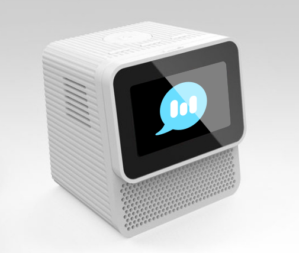
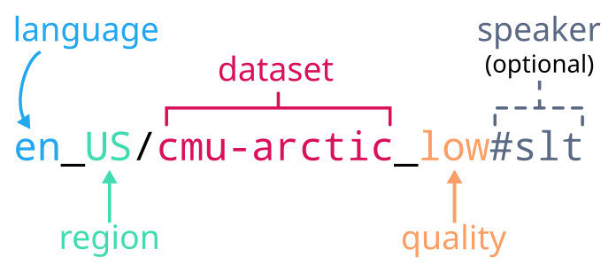

# Mimic 3



A fast and local neural text to speech system developed by [Mycroft](https://mycroft.ai/) for the [Mark II](https://mycroft.ai/product/mark-ii/).

* [Available voices](https://github.com/MycroftAI/mimic3-voices)
* [How does it work?](mimic3-tts/#architecture)


## Use Cases

* [Mycroft TTS plugin](#mycroft-tts-plugin)
    * `mycroft-say 'Hello world.'`
* [Web server](#web-server-and-client)
    * `curl -X POST --data 'Hello world.' --output - localhost:59125/api/tts | aplay`
    * Drop-in [replacement for MaryTTS](#marytts-compatibility)
* [Command-line tool](#command-line-tools)
    * `mimic3 'Hello world.' | aplay`
* [Voice for screen reader](mimic3-tts/#speech-dispatcher)
    * `spd-say 'Hello world.'`


## Dependencies

Mimic 3 requires:

* Python 3.7 or higher
* The [Onnx runtime](https://onnxruntime.ai/)
* [gruut](https://github.com/rhasspy/gruut) or [eSpeak-ng](https://github.com/espeak-ng/espeak-ng) or [epitran](https://github.com/dmort27/epitran/) (depending on the voice)


## Installation


### eSpeak

Some voices depend on [eSpeak-ng](https://github.com/espeak-ng/espeak-ng), specifically `libespeak-ng.so`. For those voices, make sure that libespeak-ng is installed with:

``` sh
sudo apt-get install libespeak-ng1
```

On 32-bit ARM platforms (a.k.a. `armv7l` or `armhf`), you will also need some extra libraries:

``` sh
sudo apt-get install libatomic1 libgomp1 libatlas-base-dev
```


### Mycroft TTS Plugin

Install the plugin:

``` sh
mycroft-pip install plugin-tts-mimic3[all]
```

Enable the plugin in your [mycroft.conf](https://mycroft-ai.gitbook.io/docs/using-mycroft-ai/customizations/mycroft-conf) file:

``` sh
mycroft-config set tts.module mimic3_tts_plug
```

or you can manually add the following to `mycroft.conf` with `mycroft-config edit user`:

``` json
"tts": {
  "module": "mimic3_tts_plug"
}
```


See the [plugin's documentation](https://github.com/MycroftAI/plugin-tts-mimic3) for more options.


### Docker image

A pre-built Docker image is available for the following platforms:

* `linux/amd64`
    * For desktops and laptops (`x86_64` CPUs)
* `linux/arm64`
    * For Raspberry 3/4 and Zero 2 with [64-bit Pi OS](https://www.raspberrypi.com/news/raspberry-pi-os-64-bit/)
* `linux/arm/v7`
    * For Raspberry Pi 1/2/3/4 and Zero 2 with 32-bit Pi OS
    
Install/update with:

``` sh
docker pull mycroftai/mimic3
```

Once installed, check out the following scripts for running:

* [`mimic3`](docker/mimic3)
* [`mimic3-server`](docker/mimic3-server)
* [`mimic3-download`](docker/mimic3-download)
    
Or you can manually run the web server with:

``` sh
docker run \
       -it \
       -p 59125:59125 \
       -v "${HOME}/.local/share/mimic3:/home/mimic3/.local/share/mimic3" \
       'mycroftai/mimic3'
```

Voices will be automatically downloaded to `${HOME}/.local/share/mimic3/voices`


### Debian Package

Grab the Debian package from the [latest release](https://github.com/mycroftAI/mimic3/releases) for your platform:

* `mimic3-tts_<version>_amd64.deb`
    * For desktops and laptops (`x86_64` CPUs)
* `mimic3-tts_<version>_arm64.deb`
    * For Raspberry 3/4 and Zero 2 with [64-bit Pi OS](https://www.raspberrypi.com/news/raspberry-pi-os-64-bit/)
* `mimic3-tts_<version>_armhf.deb`
    * For Raspberry Pi 1/2/3/4 and Zero 2 with 32-bit Pi OS
    
Once downloaded, install the package with (note the `./`):

``` sh
sudo apt install ./mimic3-tts_<version>_<platform>.deb
```

Once installed, the following commands will be available in `/usr/bin`:

* `mimic3`
* `mimic3-server`
* `mimic3-download`


### Using pip

Install the command-line tool:

``` sh
pip install mimic3-tts[all]
```

Once installed, the following commands will be available:

* `mimic3`
* `mimic3-download`

Install the HTTP web server:

``` sh
pip install mimic3-http[all]
```

Once installed, the following commands will be available:

* `mimic3-server`

Language support can be selectively installed by replacing `all` with:

* `de` - German
* `es` - Spanish
* `fa` - Farsi
* `fr` - French
* `it` - Italian
* `nl` - Dutch
* `ru` - Russian
* `sw` - Kiswahili

Excluding `[..]` entirely will install support for English only.


### From Source

Clone the repository:

``` sh
git clone https://github.com/MycroftAI/mimic3.git
```

Run the install script:

``` sh
cd mimic3/
./install.sh
```

A virtual environment will be created in `mimic3/.venv` and each of the Python modules will be installed in editiable mode (`pip install -e`).

Once installed, the following commands will be available in `.venv/bin`:

* `mimic3`
* `mimic3-server`
* `mimic3-download`


## Voice Keys

Mimic 3 references voices with the format:

* `<language>_<region>/<dataset>_<quality>` for single speaker voices, and
* `<language>_<region>/<dataset>_<quality>#<speaker>` for multi-speaker voices 
    * `<speaker>` can be a name or number starting at 0
    * Speaker names come from a voice's `speakers.txt` file
    

    
For example, the default [Alan Pope](https://popey.me/) voice key is `en_UK/apope_low`. 
The [CMU Arctic voice](https://github.com/MycroftAI/mimic3-voices/tree/master/voices/en_US/cmu-arctic_low) contains multiple speakers, with a commonly used voice being `en_US/cmu-arctic_low#slt`.

Voices are automatically downloaded from [Github](https://github.com/MycroftAI/mimic3-voices) and stored in `${HOME}/.local/share/mimic3` (technically `${XDG_DATA_HOME}/mimic3`). You can also [manually download them](#downloading-voices).


## Running


### Command-Line Tools

The `mimic3` command can be used to synthesize audio on the command line:

``` sh
mimic3 --voice 'en_UK/apope_low' 'My hovercraft is full of eels.' > hovercraft_eels.wav
```

See [voice keys](#voice-keys) for how to reference voices and speakers.

See `mimic3 --help` or the [CLI documentation](mimic3-tts/) for more details.


#### Downloading Voices

Mimic 3 automatically downloads voices when they're first used, but you can manually download them too with `mimic3-download`.

For example:

``` sh
mimic3-download 'en_US/*'
```

will download all U.S. English voices to `${HOME}/.local/share/mimic3`.

See `mimic3-download --help` for more options.


### Web Server and Client

Start a web server with `mimic3-server` and visit `http://localhost:59125` to view the web UI.


The following endpoints are available:

* `/api/tts`
    * `POST` text or [SSML](#ssml) and receive WAV audio back
    * Use `?voice=` to select a different [voice/speaker](#voice-keys)
    * Set `Content-Type` to `application/ssml+xml` (or use `?ssml=1`) for [SSML](#ssml) input
* `/api/voices`
    * Returns a JSON list of available voices
    
An [OpenAPI](https://www.openapis.org/) test page is also available at `http://localhost:59125/openapi`

See `mimic3-server --help` for the [web server documentation](mimic3-http/) for more details.


#### Web Client

The `mimic3` program provides an interface to the Mimic 3 web server when the `--remote` option is given.

Assuming you have started `mimic3-server` and can access `http://localhost:59125`, then:

``` sh
mimic3 --remote --voice 'en_UK/apope_low' 'My hovercraft is full of eels.' > hovercraft_eels.wav
```

If your server is somewhere besides `localhost`, use `mimic3 --remote <URL> ...`

See `mimic3 --help` for more options.


## CUDA Acceleration

If you have a GPU with support for CUDA, you can accelerate synthesis with the `--cuda` flag when running `mimic3` or `mimic3-server`. This requires you to install the [onnxruntime-gpu](https://pypi.org/project/onnxruntime-gpu/) Python package.

Using [nvidia-docker](https://github.com/NVIDIA/nvidia-docker) is highly recommended. See [ Dockerfile.gpu](Dockerfile.gpu) for an example of how to build a compatible container.


## MaryTTS Compatibility

Use the Mimic 3 web server as a drop-in replacement for [MaryTTS](http://mary.dfki.de/), for example with [Home Assistant](https://www.home-assistant.io/integrations/marytts/).

Make sure to use a compatible [voice key](#voice-keys) like `en_UK/apope_low`.

For Mycroft, you can use this instead of [the plugin](https://github.com/MycroftAI/plugin-tts-mimic3) by running:


``` sh
mycroft-config edit user
```

and then adding the following:

``` json
"tts": {
"module": "marytts",
"marytts": {
    "url": "http://localhost:59125",
    "voice": "en_UK/apope_low"
}
```


## SSML

A [subset of SSML](mimic3-tts/#SSML) (Speech Synthesis Markup Language) is supported.

For example:

``` xml
<speak>
  <voice name="en_UK/apope_low">
    <s>
      Welcome to the world of speech synthesis.
    </s>
  </voice>
  <break time="3s" />
  <voice name="en_US/cmu-arctic_low#slt">
    <s>
      <prosody volume="soft" rate="150%">
        This is a <say-as interpret-as="number" format="ordinal">2</say-as> voice.
      </prosody>
    </s>
  </voice>
</speak>
```

will speak the two sentences with different voices and a 3 second second pause in between. The second sentence will also have the number "2" pronounced as "second" (ordinal form).

SSML `<say-as>` support varies between voice types:

* [gruut](https://github.com/rhasspy/gruut/#ssml)
* [eSpeak-ng](http://espeak.sourceforge.net/ssml.html)
* [epitran](https://github.com/dmort27/epitran/) voices do not currently support `<say-as>`
* Character-based voices do not currently support `<say-as>`


## License

See [license file](LICENSE)
