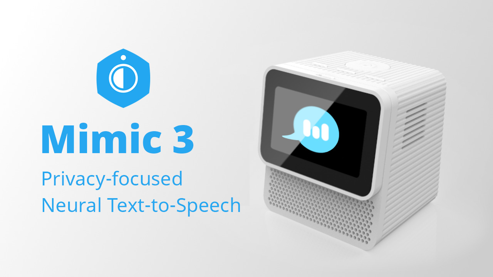

# ⚠️ This project is no longer actively maintained

Mycroft Mimic 3 is no longer maintained and may not work on your computer anymore. [Piper TTS](https://github.com/rhasspy/piper) is the spiritual successor to Mimic 3. 

# Mimic 3



A fast and local neural text to speech system developed by [Mycroft](https://mycroft.ai/) for the [Mark II](https://mycroft.ai/product/mark-ii/).

* [Available voices](https://github.com/MycroftAI/mimic3-voices)
* [Documentation](https://mycroft-ai.gitbook.io/docs/mycroft-technologies/mimic-tts/coming-soon-mimic-3)
* [How does it work?](https://mycroft-ai.gitbook.io/docs/mycroft-technologies/mimic-tts/coming-soon-mimic-3#how-it-works)


## Quickstart

### Mycroft TTS Plugin

``` sh
# Install system packages
sudo apt-get install libespeak-ng1

# Ensure that you're using the latest pip
mycroft-pip install --upgrade pip

# Install plugin
mycroft-pip install mycroft-plugin-tts-mimic3[all]

# Activate plugin
mycroft-config set tts.module mimic3_tts_plug

# Start mycroft
mycroft-start all
```

See [documentation](https://mycroft-ai.gitbook.io/docs/mycroft-technologies/mimic-tts/coming-soon-mimic-3#tts-plugin-for-mycroft-ai) for more details.


### Web Server

``` sh
mkdir -p "${HOME}/.local/share/mycroft/mimic3"
chmod a+rwx "${HOME}/.local/share/mycroft/mimic3"
docker run \
       -it \
       -p 59125:59125 \
       -v "${HOME}/.local/share/mycroft/mimic3:/home/mimic3/.local/share/mycroft/mimic3" \
       'mycroftai/mimic3'
```

Visit [http://localhost:59125](http://localhost:59125) or from another terminal:


``` sh
curl -X POST --data 'Hello world.' --output - localhost:59125/api/tts | aplay

```

See [documentation](https://mycroft-ai.gitbook.io/docs/mycroft-technologies/mimic-tts/coming-soon-mimic-3#web-server) for more details.


### Command-Line Tool

``` sh
# Install system packages
sudo apt-get install libespeak-ng1

# Create virtual environment
python3 -m venv .venv
source .venv/bin/activate
pip3 install --upgrade pip

pip3 install mycroft-mimic3-tts[all]
```

Now you can run:

``` sh
mimic3 'Hello world.' | aplay
```

Use `mimic3-server` and `mimic3 --remote ...` for repeated usage (much faster).

See [documentation](https://mycroft-ai.gitbook.io/docs/mycroft-technologies/mimic-tts/coming-soon-mimic-3#command-line-interface) for more details.


---


## License

Mimic 3 is available under the [AGPL v3 license](LICENSE)
